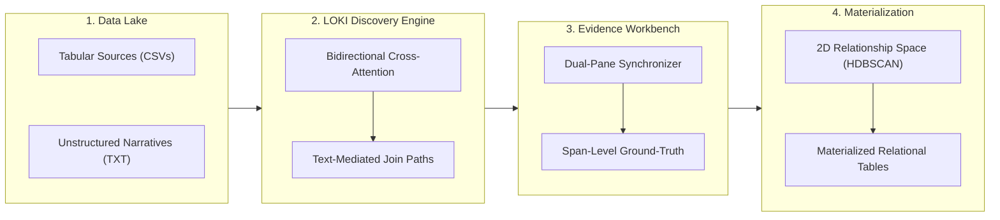

# IDUN: Integrating Data-lake of Unstructured Nature

[](https://dtak-upc.github.io/IDUN/)
[](LICENSE)

**IDUN** is an interactive web workspace and research prototype for **discovery-driven integration of disjoint tables and narrative text** within complex data lakes.

🌐 **Public Demo:** [https://dtak-upc.github.io/IDUN/](https://dtak-upc.github.io/IDUN/)

---

## What is IDUN?

In modern data lakes (particularly across healthcare, biomedicine, and enterprise analytics), valuable information is fragmented across:
- **Disjoint Tabular Sources:** Relational tables (such as diagnoses, medications, lab tests, and procedures) that lack shared foreign keys, common entity identifiers, or aligned schemas.
- **Unstructured Text:** Clinical notes, discharge summaries, and medical reports that describe relationships naturally but remain disconnected from relational databases.

Traditional schema matching and entity resolution techniques fail when tables share neither attribute names nor overlapping key distributions. **IDUN** overcomes this limitation by leveraging unstructured narrative text as **text-mediated join paths**. Rather than relying on manual foreign-key engineering or monolithic prompt-based LLM generation, IDUN discovers latent semantic connections between relational rows and narrative sentences, maps them into a shared space, and materializes high-purity integrated tables with complete provenance.

> **Note on Live Inference:** Live model inference and GPU cross-attention execution are locked in this public web demonstration due to a parallel publication (LOKI) being under review. Everything will be hosted eventually. All interactive discovery, evidences, integration, and materialized relations as joined tables are actual inference results (pre-computed) using synthetic benchmark data and fully navigable.

---

## How It Works

IDUN’s end-to-end integration pipeline comprises four core stages:



1. **Heterogeneous Lake Ingestion & Profiling:** Ingests raw tabular CSVs and narrative TXT documents without requiring pre-aligned schemas or primary-foreign key pairs.
2. **Latent-Space Discovery (LOKI):** Employs **LOKI** (*Latent-Space Optimization for Knowledge Integration*), using bidirectional cross-attention with query-dependent gating to project table rows and text sentences into a joint space, scoring candidate connections across disjoint tables.
3. **Evidence-Linked Grounding:** Discovered semantic joins are not black-box guesses; each connection links directly to supporting narrative text excerpts with character-level span highlighting.
4. **Relationship Space & Materialization:** Visualizes row-pair contextual embeddings in a 2D projection space clustered via **HDBSCAN**. Filtered high-purity paths are categorized into specific relationship types (e.g., *medication used for diagnosis*, *indication*, *therapeutic use*) and materialized into structured relational tables.

---

## Navigating the Website

When exploring the [interactive prototype](https://dtak-upc.github.io/IDUN/), you can navigate through the following dedicated views:

### 1. Data Lake
* **Explore Sources:** Browse the example data lake comprising independent tabular sources (diagnoses, medications) and clinical narrative notes.
* **Inspect Source Records:** View raw records, column definitions, and narrative texts.
* **Lake Profiling:** Inspect indexing metrics, representative coverage, and candidate search preparation.

### 2. Discover
* **Candidate Join Paths:** Explore semantic connections surfaced across disjoint sources.
* **Shared-Text Bridges:** Inspect cross-table bridges where narrative text provides the missing semantic link between distinct relational rows.

### 3. Evidence
* **Interactive Workbench:** Dual-pane synchronizer linking structured table rows to original narrative text spans.
* **Ground-Truth Provenance:** Click on candidate pairs to immediately highlight the exact sentences and clinical passages that justify the relationship.

### 4. Integration
* **2D Relationship Space:** A high-contrast constellation projection map visualizing HDBSCAN-clustered row pairs (supported, withheld, and conflicting pairs) in real time. Select individual points to inspect their underlying relationship.
* **Relationship Tables:** Browse materialized relational tables organized by semantic relation category.
* **Differential Comparison:** Compare results across runs to inspect newly proposed, changed, or withheld relationships.

### 5. Activity & Settings
* **Event Ledger:** Trace historical indexing, discovery, and materialization events.
* **Model Configurations:** View provider specifications (e.g., in-process Hugging Face models, Ollama, LM Studio, or OpenAI-compatible backends) supported by the full research backend.

---

## Quick Start (Running Locally)

To run the frontend prototype locally:

### Prerequisites
* **Node.js**: 22.12 or later (Node 24 recommended).

### Installation & Launch

```bash
# Clone the repository
git clone https://github.com/dtak-upc/IDUN.git
cd IDUN

# Install dependencies
npm ci

# Start the local development server
npm run dev
```

Open [http://localhost:5173](http://localhost:5173) in your browser.

### Building for Production

```bash
# Type check and build the static showcase bundle
npm run build:showcase

# Package for GitHub Pages publication
npm run build:pages
```

---

## Research Foundations

IDUN is built on foundational research in data integration, semantic discovery, and text conceptualization:

* **LOKI:** *Discovery-Driven Integration of Disjoint Tables via Text* (VLDB 2027) — Latent-space cross-attention and text-mediated join discovery.
* **THOR:** *Mitigating Data Sparsity in Integrated Data through Text Conceptualization* (ICDE 2024) — Deep concept mapping and data augmentation for sparse data lakes.

---

## License

This project is licensed under the **GNU General Public License v3.0 (GPL-3.0)**. See the [LICENSE](LICENSE) file for details.
